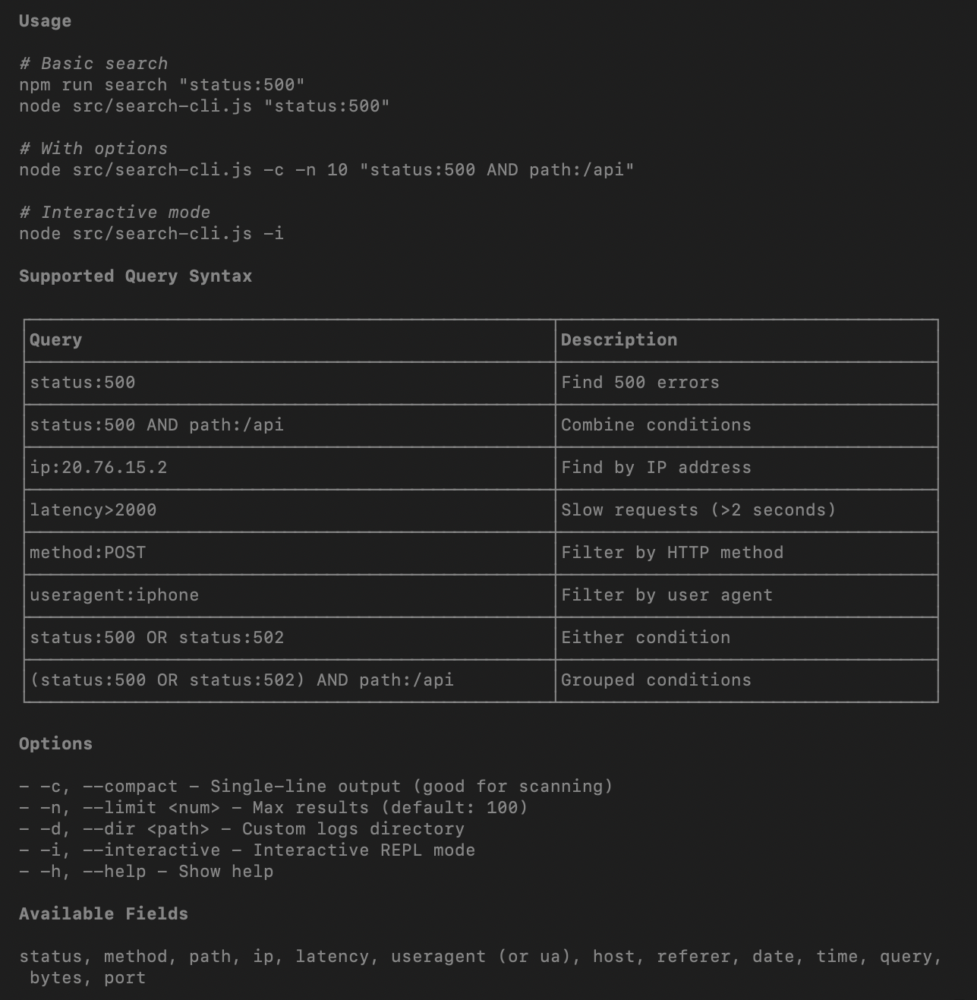

# Azure Log Downloader

Downloads Azure Web App logs from Azure Blob Storage on a configurable schedule (default: every hour).

## Setup

```bash
npm install
cp .env.example .env
# edit .env with your credentials and settings
```

## Configuration (`.env`)

| Variable                          | Required                | Description                                                             |
| --------------------------------- | ----------------------- | ----------------------------------------------------------------------- |
| `AZURE_STORAGE_CONNECTION_STRING` | one of the auth options | Full connection string from the Azure portal                            |
| `AZURE_STORAGE_ACCOUNT_NAME`      | one of the auth options | Storage account name                                                    |
| `AZURE_STORAGE_ACCOUNT_KEY`       | optional                | Account key (used with account name)                                    |
| `CONTAINER_NAMES`                 | yes                     | Comma-separated list of blob container names                            |
| `OUTPUT_DIR`                      | no                      | Local folder for downloaded logs (default: `./downloaded-logs`)         |
| `POLL_INTERVAL_MS`                | no                      | Poll interval in ms (default: `3600000` = 1 hour)                       |
| `BLOB_PREFIX`                     | no                      | Filter blobs by name prefix (e.g. `mysite/LogFiles/`)                   |
| `SINCE_DATE`                      | no                      | ISO date string; only blobs newer than this are downloaded on first run |
| `LOG_LEVEL`                       | no                      | `debug`, `info` (default), `warn`, or `error`                           |

### Auth methods (pick one)

**Connection string** — simplest, paste directly from the Azure portal:

```
AZURE_STORAGE_CONNECTION_STRING=DefaultEndpointsProtocol=https;AccountName=...
```

**Account name + key:**

```
AZURE_STORAGE_ACCOUNT_NAME=mystorageaccount
AZURE_STORAGE_ACCOUNT_KEY=base64key==
```

**Managed Identity / Service Principal** (recommended for production — no secrets in env):

```
AZURE_STORAGE_ACCOUNT_NAME=mystorageaccount
AZURE_CLIENT_ID=...
AZURE_TENANT_ID=...
AZURE_CLIENT_SECRET=...
```

## Run

```bash
npm start
```

## How it works

1. On startup the app reads `.last-run-state.json` (if it exists) to find out where it left off.
2. It lists every blob in each configured container that was **modified after** the last run time.
3. Each new blob is downloaded to `<OUTPUT_DIR>/<container>/<blob-path>`.
4. Blobs that already exist locally with the correct file size are skipped.
5. The last-run timestamp is persisted so restarts do not re-download old logs.
6. Steps 2–5 repeat every `POLL_INTERVAL_MS` milliseconds.

## Azure App Service log paths

Azure App Service writes logs to containers like:

```
site-name/LogFiles/http/RawLogs/YYYY/MM/DD/...
```

Set `BLOB_PREFIX=mysite/LogFiles/` to filter to one specific site.


